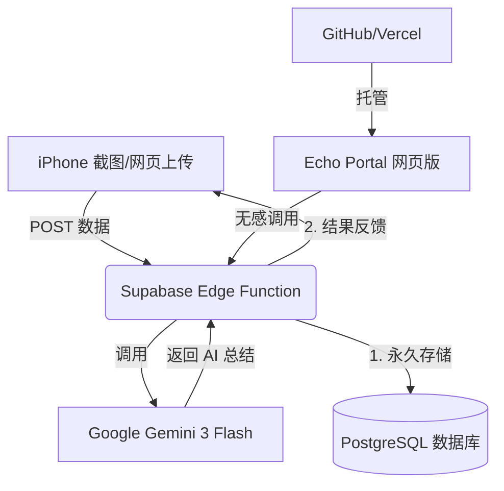

# 第三课作业：给生活装上云端大脑 (Smart Life Echo)

## 1. 作业目标：从“本地工具”进化为“云产品”
本课程的核心目标是将第二课构思的“屏幕时间复盘”逻辑，通过云原生技术（Cloud-Native）实现真正的自动化与公网访问，打破本地设备与 API Key 的限制。

## 2. 系统架构图 (Architecture)

## 3. 核心实施过程 (Core Milestones)

### 3.1 搭建云端中转站 (Supabase Backend)
- **Edge Function 部署**：利用 Deno 编写了 `echo-process` 函数，作为项目的核心枢纽。
- **安全性处理**：通过环境变量（Secrets）在服务端安全存储 Gemini API Key，实现前端“无感”调用。
- **多模态升级**：代码支持同时接收文字和图片 Base64，利用 Gemini 3 的视觉能力提高识别准确度。

### 3.2 建立永久记忆库 (Database)
- 在 Supabase 中创建了 `daily_narratives` 表。
- 实现了每次复盘自动 `upsert` 逻辑，确保用户的每一份回声都有据可查，不会因手机丢失而遗忘。

### 3.3 构建公网门户 (Frontend & Hosting)
- **Web Portal**：重构了 `echo_portal.html`，删除了所有本地配置输入，直接连接云端接口。
- **Vercel 部署**：将网页一键部署至 Vercel，获得了永久公网域名。
- **GitHub 同步**：源代码已托管至 GitHub，实现了职业级的代码版本管理。

## 4. 关键技术攻克 (Troubleshooting)
- **模型版本更迭**：在 2026 年的时间线上，传统的 `gemini-1.5-flash` 已更新，成功通过自检逻辑切换到 `gemini-flash-latest` (Gemini 3)。
- **CORS 跨域修复**：解决了 Vercel 网页访问 Supabase 函数时的跨域授权报错。
- **人设调优**：响应“极简主义”需求，去除了话痨人设，打造了更加客观中性的“数字分身”分析风格。

## 5. 最终成果清单 (Deliverables)
- **专属 API 接口**：`https://kobnjjkouzatalitkeqr.supabase.co/functions/v1/echo-process`
- **公网网页地址**：[https://screentime-portal.vercel.app](https://screentime-portal.vercel.app)
- **GitHub 源代码**：[https://github.com/ziheiguai/screentime](https://github.com/ziheiguai/screentime)
- **数据库历史记录**：已在 Supabase 成功跑通数据入库。

## 6. 学习回顾
> “通过这一课，我深刻理解了‘云’的作用。它不仅仅是存储，它更像是一个 24 小时在线的执勤官，帮我保管密钥、处理逻辑、记录生活。这才是真正‘Vibe’的开始。”

---
**作业提交人：** ziheiguai
**日期：** 2026-02-04
